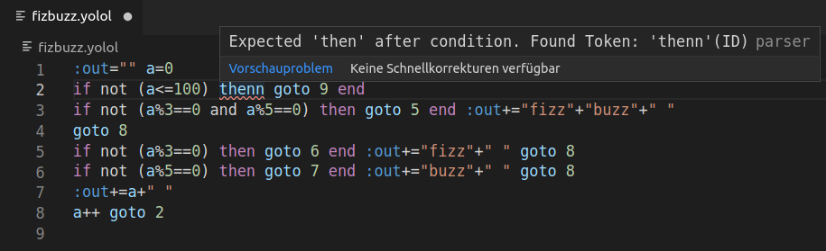

# YODK - YOLOL Development Kit

# What is YOLOL?
YOLOL is the ingame programming language for the upcoming game starbase.

# What is the YODK?
The yodk aims to be a toolkit that helps with the development of YOLOL-Scripts. YOLOL is a pretty limmited language and the lack of common features is really annoying for experienced programmers. The yodk (and in the future especially nolol) will try to mitigate this.

# Installation
You will need to have the go-toolchain installed.  
```go install github.com/dbaumgarten/yodk```  
Binary releases will be provided later.  
Note: It is helpfull to add the yodk-binary to your path.

# Features

## Debugger
Run YOLOL-Code, set breakpoints, step through execution and inspect variables.

```
#yodk debug fizbuzz.yolol 
Loaded and paused programm. Enter 'run' to execute
>>> l
--Programm--
>   1 :out="" a=0
    2 if not (a<=100) then goto 9 end
    3 if not (a%3==0 and a%5==0) then goto 5 end :out+="fizz"+"buzz"+" "
    4 goto 8
    5 if not (a%3==0) then goto 6 end :out+="fizz"+" " goto 8
    6 if not (a%5==0) then goto 7 end :out+="buzz"+" " goto 8
    7 :out+=a+" "
    8 a++ goto 2
    9 
>>> r
--Started--
>>> --Program finished--
--Enter r to restart--
>>> 
>>> vars
--Variables--
:out 'fizzbuzz 1 2 fizz 4 buzz fizz 7 8 fizz buzz 11 fizz 13 14 fizzbuzz 16 17 fizz 19 buzz fizz 22 23 fizz buzz 26 fizz 28 29 
>>>  

```

## Optimizer
Automatically optimize YOLOL-Code. Evaluate static expressions, shorten variable names and remove comments.

input.yolol:
```
superVerboseVariable = 5 //helpfull comment
anotherVar = (2+3)^2 * 5
:output = superVerboseVariable+anotherVar
```
```
#yodk optimize input.yolol
```
input-opt.yolol
```
a=5
b=125
:output=a+b
```

## Verifier
Check if YOLOL-code is valid.

input.yolol:
```
x = 3
if x == 4 then y=5
```
```
#yodk verify unopt-opt.yolol 
Error when parsing file: Parser error at Line: 2, Coloumn: 1 (up to Line: 2, Coloumn: 22): Expected 'end' after if statement. Found Token: ''(Newline)
```

## vscode Extension
Extension for visual studio code. Adds syntax highlighting and validation. [More information](vscode-yolol/README.md)



## Implementation of the language server protocol
Can be used to add support for YOLOL to many IDEs. Just run ```yodk langserv``` to start a server instance. Refer to the documentation of your IDE on how to integrate a language server into it.

## NOLOL
A highly experimental dialect of YOLOL. Nolol is for yolol what typescript is for javascript. It adds missing features like loops, labeled gotos, multiline ifs and compile-time constants and is compiled to plain YOLOL to be used within starbase. The compiled code is also optimized. Variable names are shortened and as many statements are merged into one line as possible, to get as much as possible of the 20 lines of a YOLOL-Chip.

fizzbuzz.nolol:
```
const fizz = "fizz"
const buzz = "buzz"
const sep = " "
:out = ""
number = 0
while number<=100 do
    if number%3==0 and number%5==0 then
        :out+=fizz+buzz+sep
        goto next
    end
    if number%3==0 then
        :out+=fizz+sep
        goto next
    end
    if number%5==0 then
        :out+=buzz+sep
        goto next
    end
    :out += number + sep
    next>
    number++
end
```
```
yodk compile fizzbuz.nolol
```

fizzbuzz.yolol:
```
:out="" a=0
if not (a<=100) then goto 9 end
if not (a%3==0 and a%5==0) then goto 5 end :out+="fizz"+"buzz"+" "
goto 8
if not (a%3==0) then goto 6 end :out+="fizz"+" " goto 8
if not (a%5==0) then goto 7 end :out+="buzz"+" " goto 8
:out+=a+" "
a++ goto 2

```

# Upcoming features
- Automated testing: Define test-cases for your yolol code
- continue, break, elseif and variable aliases for NOLOL
- Implement debug adapter protocoll to enable debugging with vscode

# Compatibility guarantees
Absolutely none. There will be massive changes to the codebase in the near future and things WILL definetly break.  

Also, as starbase has not been released, there is a lot of guesswork involved in the code. The goal is to be 100% compatible to starbase's implementation.

# Contributing
Found bugs, suggestions, want to add features? Sure. Just open an issue.